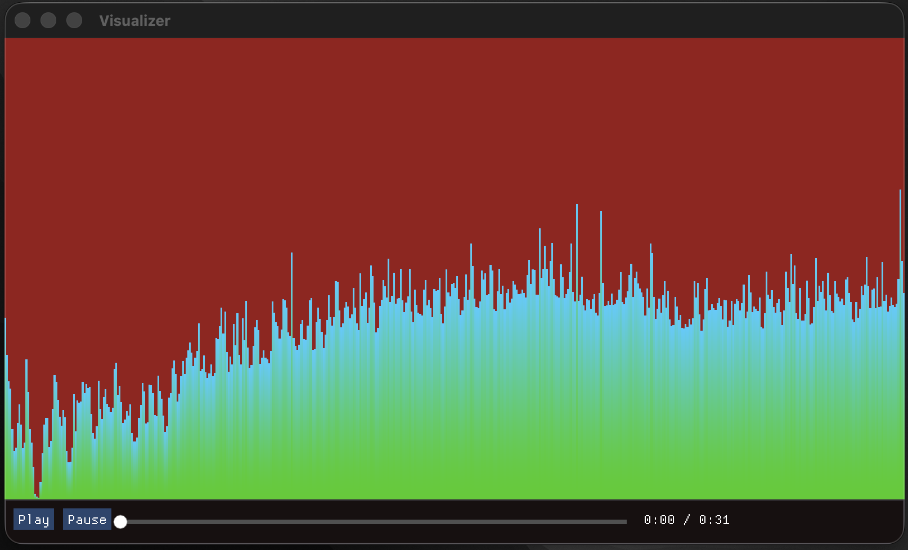

# Audio-Visualizer in C++
C++/OpenGL/SDL3/Dear ImGui/KissFFTを使用して作成したオーディオビジュアライザーです。

- `wav`ファイルの再生機能
- 音声波形の可視化
- Dear ImGuiによるUI操作

# 外部ライブラリ
OpenGLとSDL3は、お使いの環境に合わせて公式ドキュメントを参照してインストールしてください。

Dear ImGuiとKissFFTを使用する際は、以下のコマンドを実行してください。
```bash
mkdir external
cd external

git clone https://github.com/ocornut/imgui

git clone https://github.com/mborgerding/kissfft.git
```

# build
コンパイルする際にはルートディレクトリで以下を実行してください。

```bash
cmake -S . -B build
cmake --build build
```
  
これでbuildフォルダに`./main`実行ファイルが作成されます。

# 実行
`src`フォルダ下に`music.wav`を設置してください。
その後、以下を実行します。

```bash
cd build
./main
```


    
GUI操作と`A`, `S`キーによる操作ができます。

# License
MIT License